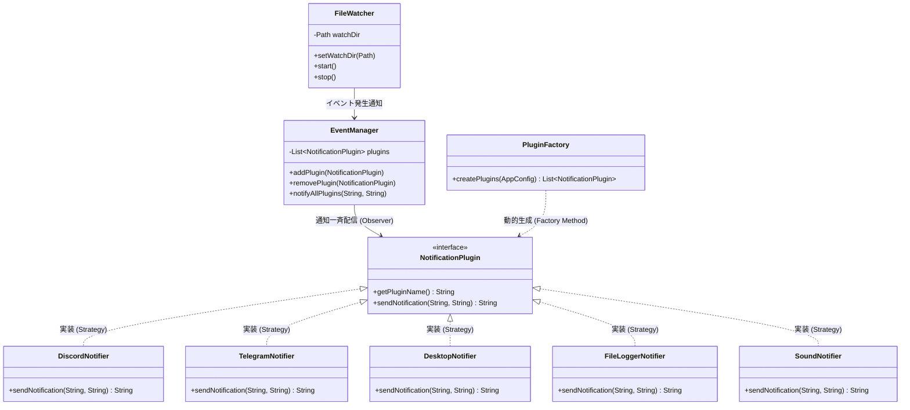

# 通知Hub (Notification Hub) 📢

スマート通知・ログ出力一元管理システム。  
イベント発生時に、登録された複数の通知プラグイン（Discord, Telegram, OSデスクトップ通知等）へ一斉通知を配信する拡張型アプリケーションです。

---

## 🌟 主な特徴

- 外部ライブラリ不使用（**Java標準API** のみで構築）
- **GoFデザインパターン3種類**を導入し、極めて高い拡張性を実現
- **GUI (Java Swing ダークモード)** および **CUI** の両対応
- **ファイル自動監視トリガー (`FileWatcher`)** によるフォルダ動的選択・自動検知通知
- **5種類の多彩な通知プラグイン**（Discord, Telegram, OSデスクトップ通知, ローカルファイルログ保存, サウンド通知）搭載

---

## 🏗️ 採用しているデザインパターン (GoF) ＆ アーキテクチャ図

本プロジェクトは「**他人が拡張して初めて完成する**」思想に基づき、コアコードを変更せずに機能を拡張できるよう以下の3つのパターンを採用しています。

### アーキテクチャ構造図 (ASCII Art)
```
                                ┌──────────────────────┐
                                │   PluginFactory      │ (Factory Method)
                                │  (config.properties) │
                                └──────────┬───────────┘
                                           │ 生成
                                           ▼
 ┌────────────────┐     ┌──────────────────────┐     ┌──────────────────────┐
 │  FileWatcher   ├────>│    EventManager      │────>│ NotificationPlugin   │ (Strategy)
 │(GUI動的フォルダ)│通知 │   (Subject/Observer) │一斉 │  - DiscordNotifier   │
 │ ManualTrigger  │     └──────────────────────┘配信 │  - TelegramNotifier  │
 └────────────────┘           (Observer)              │  - DesktopNotifier   │
                                                      │  - FileLoggerNotifier│
                                                      │  - SoundNotifier     │
                                                      └──────────────────────┘
```

### コンポーネント関係図 (Mermaid)


### 1. Strategy パターン
- **インターフェース**: `plugin.NotificationPlugin`
- **役割**: 各通知手段（Discord, Telegram, デスクトップ通知, ローカルログ保存, ビープ音）の送信ロジックを抽象化。
- **拡張性**: 新しい通知先を追加する際、コアコードを修正せず新クラスを1つ作成するだけで拡張可能（開放閉鎖の原則）。

### 2. Observer パターン
- **Subject役**: `core.EventManager`
- **Observer役**: `plugin.NotificationPlugin`
- **役割**: 複数の通知プラグインを保持し、イベント発生時に `notifyAllPlugins()` で一斉配信。
- **動的拡張性**: GUI上のチェックボックス操作で、実行時にリアルタイムで通知先の追加（`addPlugin`）や解除（`removePlugin`）が可能。

### 3. Factory Method パターン
- **Factoryクラス**: `factory.PluginFactory`
- **役割**: `src/config.properties` の `enabled.plugins=discord,telegram,desktop,filelogger,sound` 設定値から、必要なプラグインを動的にインスタンス化。
- **デモ性**: **設定ファイルを書き換えるだけで、Javaコードを1行も触らずに通知先の変更デモ**が行えます。

---

## 📂 ディレクトリ構成

```
notification_hub/
├── config.properties          # 実際のトークン設定 (Git管理外)
├── config.properties.example  # 設定ファイルのサンプル
├── src/
│   ├── App.java               # エントリーポイント (GUI/CUI切替)
│   ├── config/
│   │   └── AppConfig.java     # 設定ファイル読み込みユーティリティ
│   ├── core/
│   │   ├── EventManager.java  # Observer パターン (Subject)
│   │   ├── FileWatcher.java   # フォルダ自動監視トリガー（GUI動的フォルダ変更対応）
│   │   ├── LogListener.java   # ログ転送インターフェース
│   │   └── ManualTrigger.java # CUI用コンソールトリガー
│   ├── factory/
│   │   └── PluginFactory.java # Factory Method パターン
│   ├── plugin/
│   │   ├── NotificationPlugin.java # Strategy パターン (インターフェース)
│   │   ├── DiscordNotifier.java   # Discord Webhook実装
│   │   ├── TelegramNotifier.java  # Telegram Bot API実装
│   │   ├── DesktopNotifier.java   # OS標準トレイポップアップ実装
│   │   ├── FileLoggerNotifier.java# ローカルファイルログ自動追記実装
│   │   └── SoundNotifier.java     # OSビープ音・効果音再生実装
│   └── ui/
│       └── NotificationHubGUI.java # Java Swing GUI (ダークモード・フォルダ選択)
├── logs/                      # FileLoggerNotifier 出力先フォルダ
└── watch/                     # FileWatcher デフォルト監視用フォルダ
```

---

## 🚀 起動・実行手順

### 1. 設定ファイルの作成
`src/config.properties.example` をコピーして `src/config.properties` を作成し、トークン等を設定します。

```properties
discord.webhook.url=https://discord.com/api/webhooks/...
telegram.bot.token=YOUR_BOT_TOKEN
telegram.chat.id=YOUR_CHAT_ID
enabled.plugins=discord,telegram,desktop,filelogger,sound
file.logger.path=logs/notification.log
```

### 2. コンパイル
```bash
javac -d bin -sourcepath src src/App.java
```

### 3. 実行
- **GUI モード（デフォルト）**:
  ```bash
  java -cp bin App
  ```
- **CUI モード**:
  ```bash
  java -cp bin App --cui
  ```

---

## 💡 今後の拡張アイデア案 (保存メモ)

本アプリの拡張性の高さを実証するための追加プラグイン案：

1. **`FileLoggerNotifier` (ローカルログ記録プラグイン)**: 通知を `logs/notification.log` ファイルに自動追記。
2. **`SoundNotifier` (サウンド通知プラグイン)**: `java.awt.Toolkit` を使用し、通知時にピコーンとサウンドを再生。
3. **`SlackNotifier` / `LineNotifyNotifier`**: 追加のSNS連携プラグイン。
